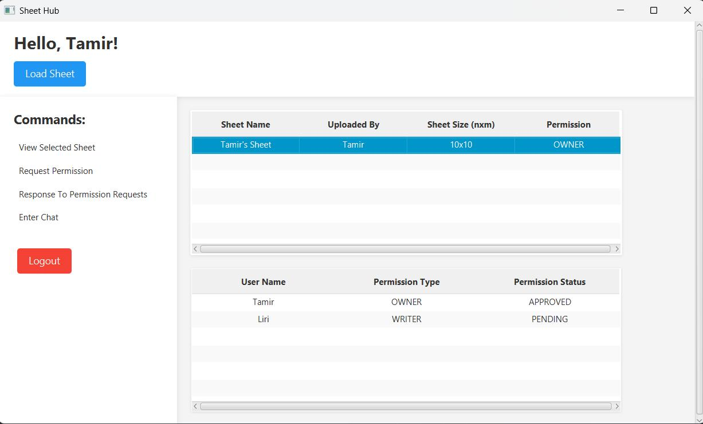
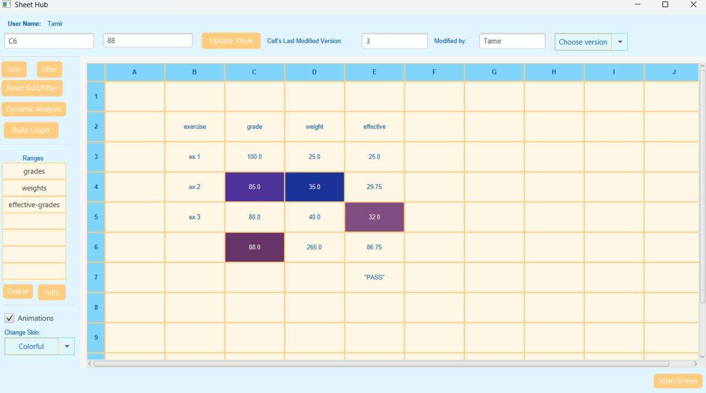
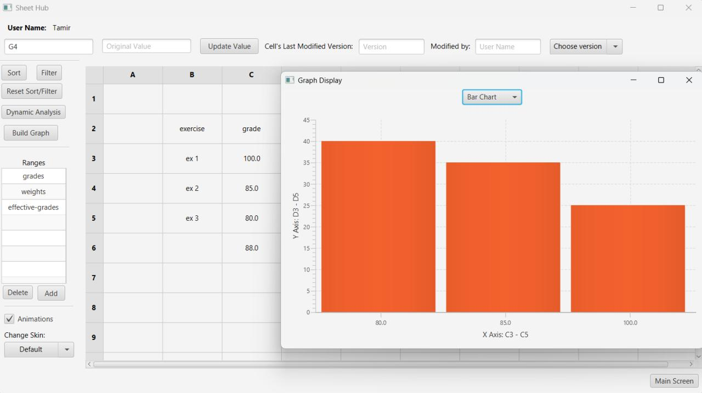
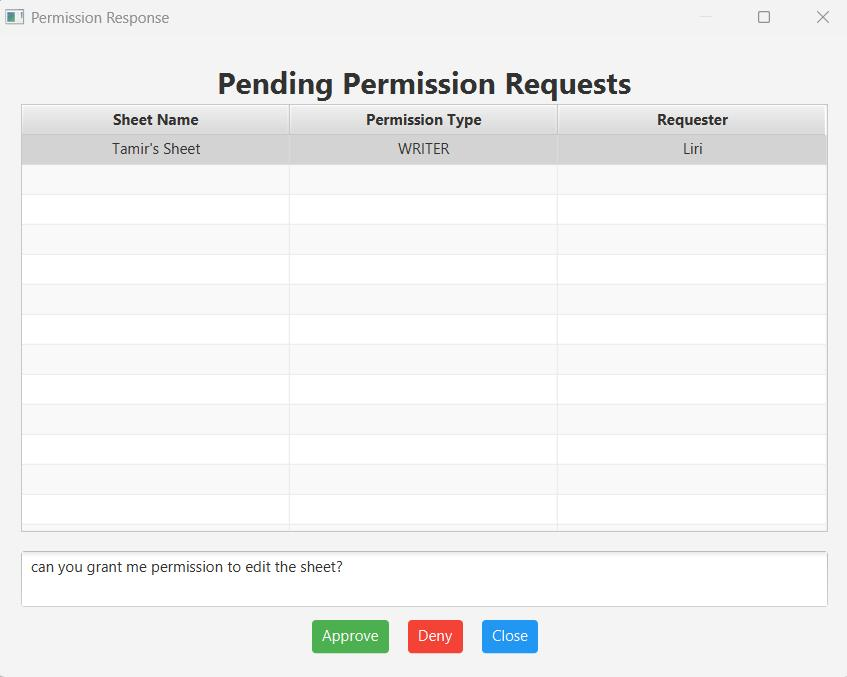
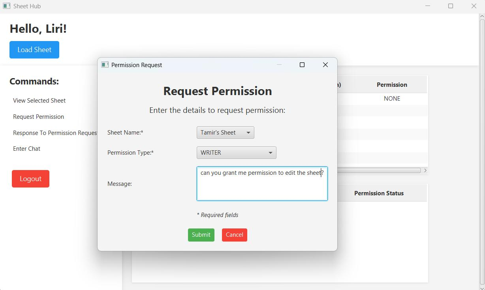
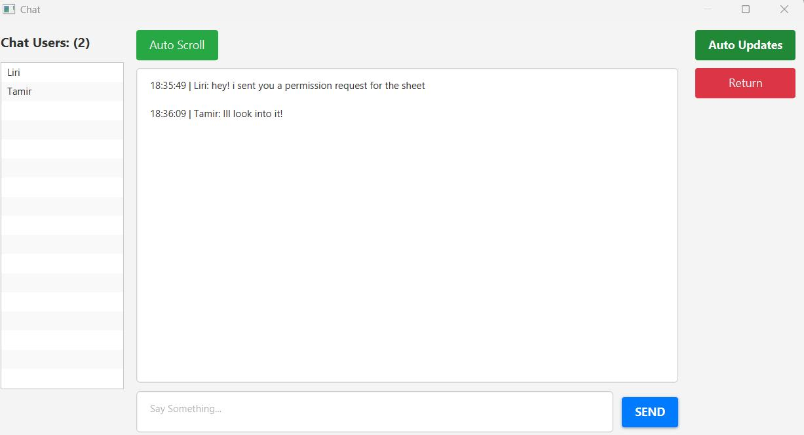

# Shticell

A collaborative spreadsheet application built with Java. Multiple users can work on spreadsheets simultaneously with real-time updates, permission management, and version history.

## Screenshots








## Key Features

**Spreadsheet Engine**
- Custom formula parser with 20+ functions (arithmetic, logical, string operations)
- Cell references (`{REF,A1}`) and named ranges (`{SUM,MyRange}`)
- Automatic dependency tracking - changing one cell recalculates all dependent cells
- Circular dependency detection

**Collaboration**
- Multi-user support with real-time updates
- Permission system (Owner / Writer / Reader)
- Permission request and approval workflow
- Built-in chat

**Data Management**
- Complete version history - view or restore any previous version
- Sort and filter data
- Cell styling (colors, alignment)

## Tech Stack

| Component | Technology |
|-----------|------------|
| Desktop Client | Java, JavaFX, FXML, CSS |
| Server | Jakarta Servlets, REST API |
| Data Format | JSON (Gson), XML (JAXB) |
| HTTP Client | OkHttp |

## Architecture

```
┌──────────────────┐     HTTP/JSON     ┌──────────────────┐
│  JavaFX Client   │ ◄──────────────► │  Servlet Server  │
│                  │                   │                  │
│  • Login         │                   │  • REST API      │
│  • Sheet Browser │                   │  • Session Mgmt  │
│  • Spreadsheet   │                   │  • Permissions   │
│    Editor        │                   │                  │
└──────────────────┘                   └────────┬─────────┘
                                                │
                                       ┌────────▼─────────┐
                                       │  System Engine   │
                                       │                  │
                                       │  • Formula Parser│
                                       │  • Dependency    │
                                       │    Graph         │
                                       │  • Version Mgmt  │
                                       └──────────────────┘
```

## Project Structure

```
Shticell/
├── ShticellClient/     # JavaFX desktop application
├── ShticellServer/     # REST API server (Jakarta Servlets)
├── SystemEngine/       # Core spreadsheet logic
├── DTO/                # Shared data transfer objects
└── examples/           # Sample spreadsheet files
```

## Formula Examples

```
{PLUS,5,3}                              → 8
{REF,A1}                                → Value of cell A1
{TIMES,{REF,B2},{REF,C2}}               → B2 × C2
{IF,{BIGGER,A1,0},Positive,Negative}    → Conditional logic
{SUM,MyRange}                           → Sum of named range
{AVERAGE,Prices}                        → Average of named range
```

**Supported Functions:** `PLUS`, `MINUS`, `TIMES`, `DIVIDE`, `MOD`, `POW`, `ABS`, `PERCENT`, `CONCAT`, `SUB`, `REF`, `IF`, `AND`, `OR`, `NOT`, `EQUAL`, `BIGGER`, `LESS`, `SUM`, `AVERAGE`

## Technical Highlights

- **Recursive descent parser** for formula evaluation with nested expression support
- **Directed acyclic graph** for dependency tracking with topological sort
- **Immutable versioning** - each edit creates a new snapshot
- **Thread-safe** session and permission management
- **Clean architecture** - API/implementation separation throughout

## Setup

**Requirements:** Java 17+, Apache Tomcat 10+, IntelliJ IDEA

1. Clone the repository
2. Open in IntelliJ IDEA
3. Deploy `ShticellServer` to Tomcat
4. Run `ShticellClientMain.java`

An example spreadsheet file is available in `examples/sample-sheet.xml`

## License

Educational project - available for learning and reference.
